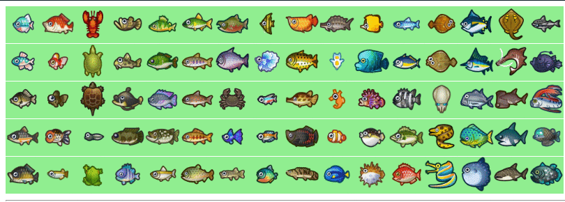
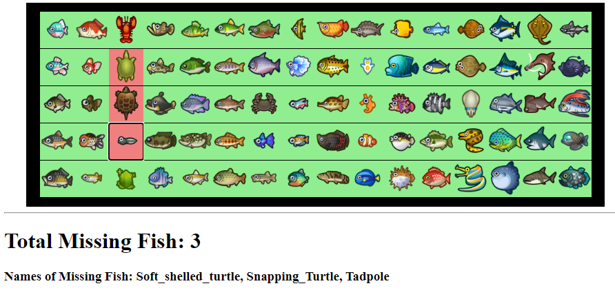

### Drafting 
This is where we hope to show the development of our project, showing our processes, improvements, and skills

### 11/27/2020  

- made a grid of the fish
- added ability to toggle buttons  
  
### 12/1/2020  

- added names to buttons
- made collections to store the data
- (kinda) neatly organizes the data to make it readable  
  
### 12/2/2020  

- added month data to buttons
- keeps track of how many fish are missing from each month
- added hemisphere toggle