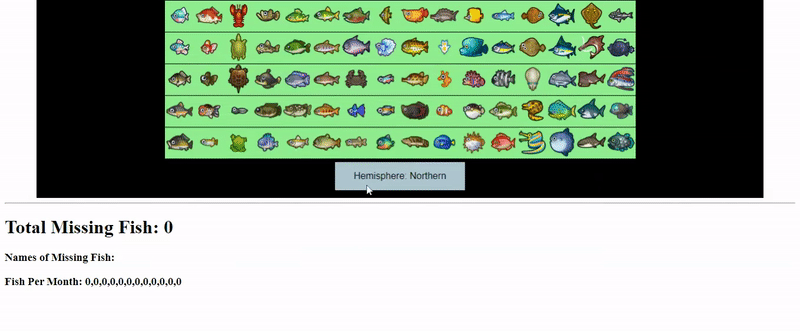
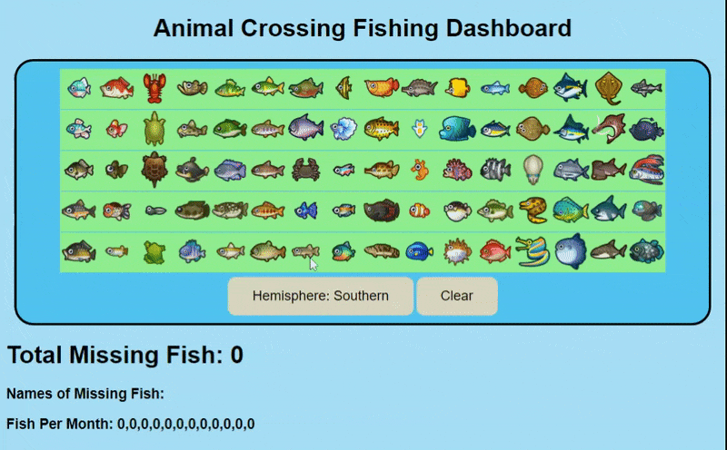
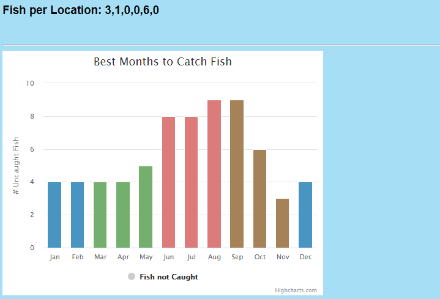

### Drafting 
This is where we hope to show the development of our project, showing our processes, improvements, and skills

### 11/27/2020  

- made a grid of the fish
- added ability to toggle buttons  
  
### 12/1/2020  

- added names to buttons
- made collections to store the data
- (kinda) neatly organizes the data to make it readable  
  
### 12/2/2020  

- added month data to buttons
- keeps track of how many fish are missing from each month
- added hemisphere toggle  
  
### 12/3/2020  

- added a clear grid button
- fixed issue when having inputs selected and then changing hemisphere
- made it less hideous for the time being  
  
### 12/10/2020  

- added first graph, with colors for season
- added second data pipeline for fish location 

### 12/13/2020

- created timeline chart of fish availability by month
  - Has icons
  - in order of last selected in fish grid interface
  - Colors decrease from top to bottom representing last selected
