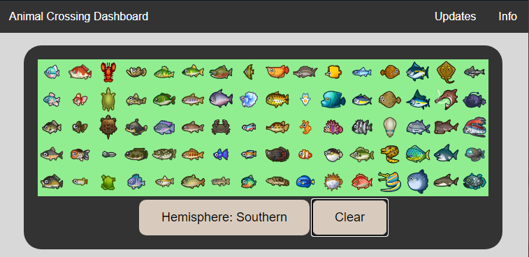

# AnimalCrossingDashboard
## Dynamic Dashboard for Animal Crossing New Horizons
[Updates and Progress](https://github.com/dylannelson/AnimalCrossingDashboard/blob/main/Drafting/README.md)  
  
[>>> Working Site <<<](https://dylannelson.github.io/AnimalCrossingDashboard/)
    

### Uses:
- Tracking the fish you've caught so far, saved locally
- See what fish you have left to collect
- See when and where to catch any missing fish

Updated with data visuals live, based off of your collection.

### Achieved Goals:
1. Make a grid for all fish and logos to represent them
2. Connect the data of each fish to their corresponding grid box
3. Allow the fish to be toggled on and off and save them locally
4. Make 4 data viz to help the users collect their remaining fish 
more efficiently
5. Host the site for others to use  
6. Scale with size: Make the bottom two graphs able to handle more than 20 data points
7. Basic aesthetics
8. Info/Help page
  
### Current Goals
9. More relevant units for first graph  
10. Better CSS/aesthetics

  
#### Stretch Goals:
Goals we would like to achieve as a bonus from our original intentions
1. Integrate the bug catalog, the second most sought afer creature
    - Requires doing all of the work above, but for a new dataset
2. Add artworks, the third most important
3. Add critters as well
4. Add additional info for each creature, like the informational quotes provided ingame
   
<ins>Credits</ins>
- [sungyeonu](https://github.com/sungyeonu/animal-crossing-scraper) for 
their web scraper and data